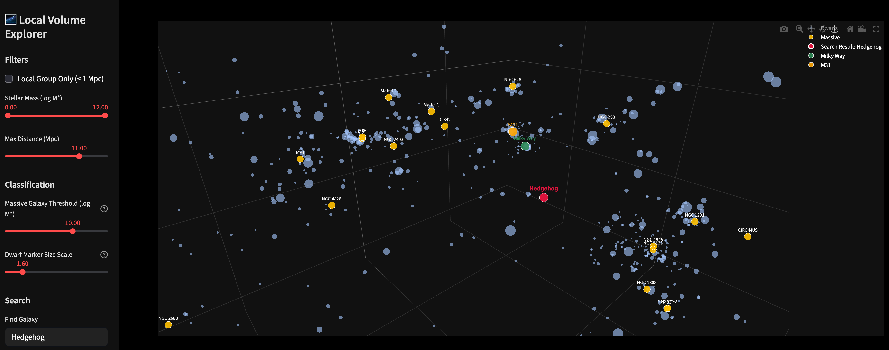

# 🌌 Local Volume Explorer

An interactive 3D visualization tool for exploring galaxies in the Local Volume, built with **Streamlit** and **Plotly**.



## 🚀 Features

*   **Interactive 3D Visualization**: Rotate, zoom, and pan through the 3D distribution of galaxies.
*   **TNG-Inspired Aesthetics**:
    *   **Massive Galaxies**: Rendered in **Golden/Amber** to represent evolved stellar populations.
    *   **Dwarf Galaxies**: Rendered in **Pale Blue** to represent young/metal-poor populations.
    *   **Dark Matter Halos**: Visualize **Virial Spheres** (Deep Purple) around massive galaxies, scaled by halo mass ($R_{vir} \propto M_h^{1/3}$).
*   **Powerful Filtering**:
    *   **Local Group Only**: Focus strictly on the neighborhood within 1 Mpc.
    *   **Stellar Mass**: Filter galaxies by log stellar mass.
    *   **Distance**: Limit the view to a specific radius (up to 15 Mpc).
*   **Search & Locate**:
    *   **Find Galaxy**: Search for any galaxy by name. The view highlights the target and allows you to **center** on it while preserving the global context.
    *   **Custom Coordinate**: Input RA/Dec/Distance to place a custom marker (e.g., for observing planning).
*   **Dark Mode**: Fully optimized dark theme for a cinematic experience.

## 🛠️ Installation

1.  **Clone the repository** (or download the files):
    ```bash
    git clone <your-repo-url>
    cd Local_Volume_Explorer
    ```

2.  **Install dependencies**:
    ```bash
    pip install -r requirements.txt
    ```

3.  **Run the app**:
    ```bash
    streamlit run app.py
    ```

4.  Open your browser to the URL shown (usually `http://localhost:8501`).

## 📂 Data

The app uses `data/LVDB_comb_all.csv` as its source catalog. Ensure this file is present in the `data/` directory.

## 🤝 Credits

Developed for the Local Volume exploration research.
*   **Visualization**: Plotly & Streamlit
*   **Science**: Based on Local Volume Database (LVDB). Halo mass estimates via Rodriguez-Puebla et al. (2017).
